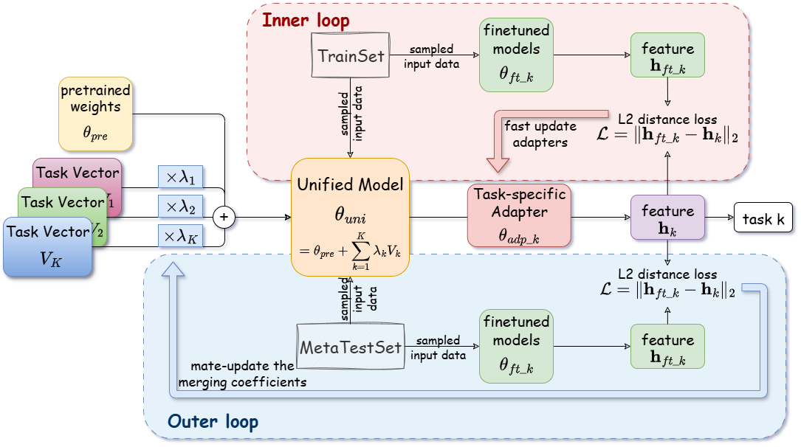

# MetaMerging

Code of Paper: "Learn to Merge: Meta-Learning for Adaptive Multi-Task Model Merging".  ICML 2026


## Dependency

We use Python 3.10.18, Pytorch 2.4.1, cuda 12.4, transformers 4.51.3, datasets 4.0.0. For more python packages, please see requirement.txt.


## Merge ViT models
Go to the folder:
```
cd merge-vit/src/
```

Download the checkpoints of pretrained and finetuned ViT models following the guide in `./merge_vit/checkpoints/README.md`.

Download the vision classification datasets following the guide in `./merge_vit/data/README.md`.

Go to line 194 in `main_meta_merging.py` and set `args.home` to your path where both `checkpoints/` and `data/` are stored.

Use the following command for merging ViT models and test in multiple tasks.
```
python main_meta_merging.py --batch_size 128 --meta_batch_size 8 --meta_batch_size_test 4 --epoch 3000 --inner_steps 1 --metalr 0.01 --adalr 0.1 --gpu 2
```


## Merge GPT-2 models
Go to the folder:
```
cd merge-lm/
```

Run the following command to download the checkpoints of pretrained and finetuned gpt-2 models from huggingface.
```
python downlead.py
```
You can manually set the download location for these models in `download.py`.

Go to file `./merge_lm/utils/load_config.py` and set the `cache_dir` to the path where the GLUE datasets will be stored.

Use the following command for running the code in parallel on 4x RTX 4090 GPUs.
```
torchrun --nproc_per_node=4 merge_gpt_glue.py --batch_size 8 --epoch 300 --inner_steps 1 --metalr 0.01 --adalr 0.1 
```
The GLUE datasets will be automatically downloaded during the first run.

## Diagram


